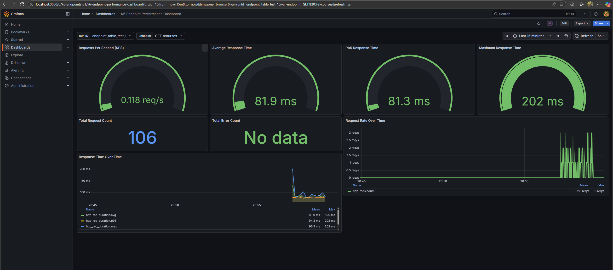
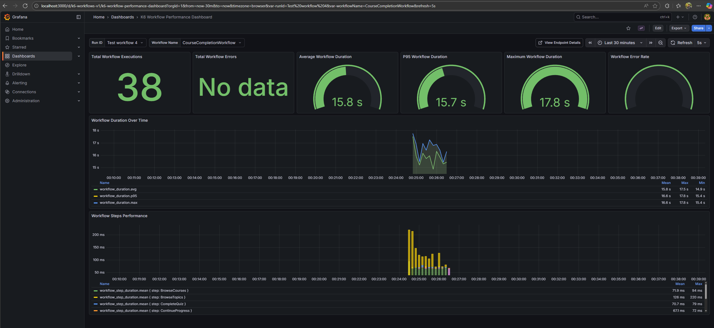

# K6 Performance Testing Framework

A comprehensive, scalable performance testing framework built with k6, featuring automated CI/CD integration, real-time metrics visualization, and support for multiple test scenarios.

## 📋 Table of Contents

- [Features](#features)
- [Architecture](#architecture)
- [Prerequisites](#prerequisites)
- [Quick Start](#quick-start)
- [Project Structure](#project-structure)
- [Running Tests](#running-tests)
- [Docker Setup](#docker-setup)
- [CI/CD Integration](#cicd-integration)
- [Grafana Dashboards](#grafana-dashboards)
- [Configuration](#configuration)
- [Test Scenarios](#test-scenarios)
- [Extending the Framework](#extending-the-framework)
- [Troubleshooting](#troubleshooting)

## ✨ Features

- **Modular Architecture**: Reusable components for authentication, data generation, and metrics
- **Multiple Test Types**: Load, Stress, Soak, and Spike testing
- **Workflow Testing**: End-to-end user journey simulation
- **Real-time Metrics**: InfluxDB integration for time-series data storage
- **Visual Dashboards**: Grafana dashboards with run filtering and detailed metrics
- **Docker Support**: Fully containerized setup for consistent environments
- **CI/CD Integration**: GitHub Actions workflows for automated testing
- **Scalable Design**: Supports 1000+ APIs, 200+ workflows, and 10+ modules
- **Best Practices**: Environment variables, no hardcoded credentials, clean code structure

## 🏗️ Architecture

```
┌─────────────┐         ┌──────────────┐         ┌─────────────┐
│    k6       │────────▶│   InfluxDB   │────────▶│   Grafana   │
│  (Tests)    │ Metrics │ (Time-Series)│  Query  │ (Dashboards)│
└─────────────┘         └──────────────┘         └─────────────┘
      │
      │ API Calls
      ▼
┌─────────────────────┐
│  API Under Test     │
│  (polanji.com)      │
└─────────────────────┘
```

## 📦 Prerequisites

### Local Setup
- **k6**: [Install k6](https://k6.io/docs/getting-started/installation/)
- **Docker & Docker Compose**: [Install Docker](https://docs.docker.com/get-docker/)
- **Git**: For version control

### Optional
- **Node.js**: For running npm scripts
- **InfluxDB**: Version 2.x (or use Docker)
- **Grafana**: Latest version (or use Docker)

## 🚀 Quick Start

### 1. Clone the Repository

```bash
git clone <repository-url>
cd assignment_k6
```

### 2. Install k6

**Windows (using Chocolatey):**
```powershell
choco install k6
```

**Windows (using Winget):**
```powershell
winget install k6 --source winget
```

**Mac (using Homebrew):**
```bash
brew install k6
```

**Linux (Debian/Ubuntu):**
```bash
sudo gpg -k
sudo gpg --no-default-keyring --keyring /usr/share/keyrings/k6-archive-keyring.gpg --keyserver hkp://keyserver.ubuntu.com:80 --recv-keys C5AD17C747E3415A3642D57D77C6C491D6AC1D69
echo "deb [signed-by=/usr/share/keyrings/k6-archive-keyring.gpg] https://dl.k6.io/deb stable main" | sudo tee /etc/apt/sources.list.d/k6.list
sudo apt-get update
sudo apt-get install k6
```

**Verify Installation:**
```bash
k6 version
```

### 3. Install Docker Desktop

**Required for InfluxDB and Grafana:**
- Download from: https://docs.docker.com/get-docker/
- Install and start Docker Desktop
- Verify: `docker --version` and `docker-compose --version`

### 4. Set Up Environment Variables

```bash
# Windows PowerShell
Copy-Item .env.example .env

# Linux/Mac
cp .env.example .env
```

**Edit `.env` file with your credentials:**
```env
BASE_URL=https://api.polanji.com
WEBSITE_URL=https://www.polanji.com
USER_EMAIL=your-email@example.com
USER_PASSWORD=your-password
```

⚠️ **Important**: Never commit the `.env` file to GitHub (already in `.gitignore`)

### 5. Start Infrastructure (Docker)

```bash
# Start InfluxDB and Grafana
docker-compose up -d

# Verify containers are running
docker-compose ps
```

**Expected Output:**
```
NAME            STATUS              PORTS
k6-influxdb     Up X seconds       0.0.0.0:8086->8086/tcp
k6-grafana      Up X seconds       0.0.0.0:3000->3000/tcp
```

This starts:
- **InfluxDB v1.8** on `http://localhost:8086` (database: `k6`)
- **Grafana** on `http://localhost:3000` (admin/admin)

### 6. Verify Grafana Setup

1. Open `http://localhost:3000`
2. Login with `admin/admin` (skip password change for local setup)
3. Go to **Dashboards** → **Browse**
4. You should see **K6** folder with 2 dashboards:
   - K6 Endpoint Performance
   - K6 Workflow Performance

### 7. Run Your First Test

```bash
# Windows PowerShell
$env:RUN_ID="my-first-test"; npm run test:load

# Linux/Mac
export RUN_ID="my-first-test"
npm run test:load

# Or using PowerShell script
.\scripts\run-test.ps1 -TestType load -RunId "my-first-test"
```

**Expected Output:**
```
     ✓ status is 200
     ✓ response time < 500ms

     checks.........................: 100.00% ✓ 1234      ✗ 0
     http_req_duration..............: avg=245ms
     http_reqs......................: 1234
```

### 8. View Results in Grafana

1. Open `http://localhost:3000`
2. Navigate to **Dashboards** → **K6** → **K6 Endpoint Performance**
3. **Set time range** to **Last 1 hour** (top-right corner)
4. Select your Run ID: `my-first-test` from dropdown
5. Select endpoint to view metrics

**Important**: Grafana shows historical data. If you see "No Data", adjust the time range to include when your test ran.

## 📁 Project Structure

```
assignment_k6/
├── .github/
│   └── workflows/                    # GitHub Actions CI/CD workflows
│       ├── performance-tests.yml     # Manual & PR triggered tests
│       └── scheduled-tests.yml       # Scheduled daily/weekly tests
├── config/
│   ├── test-config.js                # Centralized test configuration
│   └── influxdb-config.md            # InfluxDB setup guide
├── grafana/
│   ├── dashboards/                   # ✅ Grafana dashboard JSON (committed to Git)
│   │   ├── endpoint-dashboard.json   # Endpoint performance dashboard
│   │   └── workflow-dashboard.json   # Workflow performance dashboard
│   └── provisioning/                 # Auto-configuration for Grafana
│       ├── datasources/
│       │   └── influxdb.yml          # InfluxDB datasource config
│       └── dashboards/
│           └── dashboard.yml         # Dashboard provisioning config
├── tests/
│   ├── endpoints/                    # Individual API endpoint tests
│   │   ├── topics.js                 # GET /topics
│   │   ├── courses.js                # GET /courses
│   │   ├── enroll.js                 # POST /enroll
│   │   ├── update-progress.js        # POST /courses/update_progress
│   │   ├── quiz-complete.js          # POST /courses/{id}/sections/{idx}/quiz-complete
│   │   └── all-endpoints.js          # Combined endpoint test
│   ├── scenarios/                    # Performance test scenarios
│   │   ├── load-test.js              # Load testing (baseline performance)
│   │   ├── stress-test.js            # Stress testing (find breaking points)
│   │   ├── soak-test.js              # Soak testing (stability over time)
│   │   └── spike-test.js             # Spike testing (sudden load changes)
│   └── workflows/                    # User journey workflows
│       └── course-completion-workflow.js  # End-to-end course flow
├── utils/
│   ├── auth.js                       # Authentication & token management
│   ├── helpers.js                    # General utility functions
│   ├── data-generator.js             # Test data generation functions
│   └── metrics.js                    # Custom k6 metrics definitions
├── scripts/
│   ├── run-test.sh                   # Bash test runner (Linux/Mac)
│   └── run-test.ps1                  # PowerShell test runner (Windows)
├── docker-compose.yml                # Docker services orchestration
├── Dockerfile                        # k6 container configuration
├── package.json                      # npm scripts for running tests
├── .env.example                      # Environment variables template
├── .env                              # ❌ Your credentials (NOT committed)
├── .gitignore                        # Git ignore rules
├── DOCKER_GUIDE.md                   # Detailed Docker instructions
└── README.md                         # This file

📦 Docker Volumes (created automatically, NOT in Git):
├── influxdb-data/                    # ❌ Time-series test data storage
└── grafana-data/                     # ❌ Grafana settings and cache
```

**File Categories:**

| Category | Files | Committed to Git | Purpose |
|----------|-------|------------------|---------|
| **Configuration** | `*.js`, `*.yml`, `*.json` | ✅ Yes | Test settings, Docker config, dashboards |
| **Test Scripts** | `tests/**/*.js` | ✅ Yes | Performance test implementations |
| **Credentials** | `.env` | ❌ No | Your API credentials (ignored by Git) |
| **Test Data** | Docker volumes | ❌ No | Historical metrics (stays on your PC) |
| **Documentation** | `*.md` | ✅ Yes | Setup guides and documentation |

## 🧪 Running Tests

### Local Execution

#### Using PowerShell (Windows)

```powershell
# Load test
.\scripts\run-test.ps1 -TestType load -RunId "my-load-test-1"

# Stress test
.\scripts\run-test.ps1 -TestType stress

# Soak test
.\scripts\run-test.ps1 -TestType soak

# Spike test
.\scripts\run-test.ps1 -TestType spike

# Workflow test
.\scripts\run-test.ps1 -TestType workflow
```

#### Using Bash (Linux/Mac)

```bash
# Load test
./scripts/run-test.sh my-load-test-1 load dev

# Stress test
./scripts/run-test.sh my-stress-test-1 stress dev
```

#### Direct k6 Execution

```bash
# Set environment variables
export RUN_ID="test-001"
export TEST_TYPE="load"

# Run specific test
k6 run tests/scenarios/load-test.js

# With InfluxDB output
k6 run --out influxdb=http://localhost:8086 tests/scenarios/load-test.js
```

### Docker Execution

```bash
# Load test
docker-compose run --rm -e RUN_ID=docker-load-001 -e TEST_TYPE=load k6 run /tests/scenarios/load-test.js

# Stress test
docker-compose run --rm -e RUN_ID=docker-stress-001 -e TEST_TYPE=stress k6 run /tests/scenarios/stress-test.js

# Workflow test
docker-compose run --rm -e RUN_ID=docker-workflow-001 k6 run /tests/workflows/course-completion-workflow.js
```

## 🐳 Docker Setup

### Starting the Stack

```bash
# Start all services
docker-compose up -d

# View logs
docker-compose logs -f

# Check status
docker-compose ps
```

### Accessing Services

- **InfluxDB**: http://localhost:8086
  - Database: `k6`
  - No authentication required for local setup
  - Data stored in Docker volume: `influxdb-data`

- **Grafana**: http://localhost:3000
  - Username: `admin`
  - Password: `admin`
  - Dashboards auto-loaded from `grafana/dashboards/`

### Understanding Data Storage

**What gets stored where:**

```
📦 Your Computer
├── 📁 assignment_k6 (Git Repository)
│   ├── ✅ Dashboard JSON files (static query definitions)
│   ├── ✅ Test scripts
│   ├── ✅ Configuration files
│   └── ✅ Documentation
│
└── 🐳 Docker Volumes (NOT in Git)
    ├── influxdb-data
    │   └── All test data (time-series metrics)
    └── grafana-data
        └── Dashboard cache and settings
```

**Key Points:**
- ✅ **Dashboard JSON files**: Pushed to GitHub (they're just query templates, ~25 KB each)
- ❌ **Test data**: Stays on your local machine in Docker volumes (never pushed to GitHub)
- 🔄 **Each test run**: Adds data to InfluxDB with unique `runId` tag
- 📊 **Grafana**: Queries InfluxDB in real-time to display data
- 🧹 **To clear data**: `docker volume rm assignment_k6_influxdb-data` (Grafana volume can be cleared anytime)

**When someone clones your repository:**
- They get: Dashboard definitions, test scripts, configuration
- They don't get: Your historical test data (they run their own tests)
- Setup takes: ~5 minutes (install k6, start Docker, run first test)

### Stopping Services

```bash
# Stop services (keeps data)
docker-compose down

# Stop and remove volumes (clean slate - deletes all test data)
docker-compose down -v

# Restart services
docker-compose restart

# View logs
docker-compose logs -f influxdb
docker-compose logs -f grafana
```

### Troubleshooting Docker

**Containers not starting:**
```bash
# Check Docker Desktop is running
docker info

# Check container status
docker-compose ps

# View error logs
docker-compose logs
```

**Port already in use:**
```bash
# Find process using port 3000 or 8086
netstat -ano | findstr :3000
netstat -ano | findstr :8086

# Stop other services or change ports in docker-compose.yml
```

**Grafana shows "No Data":**
```bash
# Verify InfluxDB has data
docker exec k6-influxdb influx -database k6 -execute "SELECT COUNT(*) FROM http_reqs"

# Check time range in Grafana (top-right corner)
# Make sure it includes when your test ran
```

See [DOCKER_GUIDE.md](DOCKER_GUIDE.md) for detailed Docker commands.

## 🔄 CI/CD Integration

### Overview

This framework includes GitHub Actions workflows for automated performance testing in CI/CD pipelines. Tests can run on GitHub's cloud runners or send results to your cloud InfluxDB instance.

📚 **[Complete CI/CD Setup Guide](docs/CICD_SETUP_GUIDE.md)** - Detailed step-by-step instructions with screenshots and troubleshooting

### GitHub Actions Workflows

The framework includes two pre-configured GitHub Actions workflows:

#### 1. Performance Tests Workflow (`performance-tests.yml`)

**Triggers:**
- Manual dispatch (workflow_dispatch)
- Pull requests to main/develop
- Scheduled (daily at 2 AM UTC)

**Features:**
- Runs any test type (load, stress, soak, spike, workflow, endpoints)
- Uploads test results as artifacts
- Comments on PR with test results
- Supports Docker execution mode
- Sends metrics to cloud InfluxDB (optional)

**Manual Trigger:**
1. Go to Actions tab in GitHub
2. Select "K6 Performance Tests"
3. Click "Run workflow"
4. Select test type and provide Run ID
5. Click "Run workflow"

#### 2. Scheduled Tests Workflow (`scheduled-tests.yml`)

**Triggers:**
- Daily load tests at 2 AM UTC
- Weekly stress tests (Mondays at 3 AM UTC)

**Features:**
- Automatic performance regression testing
- Continuous monitoring of API performance
- Results stored in cloud InfluxDB for historical analysis

---

## 🚀 Step-by-Step: Setting Up CI/CD Pipeline

### Step 1: Push Your Code to GitHub

**1.1. Create a GitHub Repository**

```bash
# Go to github.com and create a new repository
# Name it: k6-performance-testing (or any name you prefer)
# Make it Private (recommended for API credentials)
```

**1.2. Initialize Git and Push**

```bash
# Navigate to your project folder
cd E:\Documents\Work\assignment_k6

# Initialize git (if not already done)
git init

# Add all files
git add .

# Commit
git commit -m "Initial commit: K6 performance testing framework"

# Add remote repository (replace with your repo URL)
git remote add origin https://github.com/YOUR_USERNAME/k6-performance-testing.git

# Push to GitHub
git branch -M main
git push -u origin main
```

**1.3. Verify Upload**
- Go to your GitHub repository
- Confirm all files are uploaded (except `.env` - should be ignored)
- Check that `grafana/dashboards/*.json` files are present

---

### Step 2: Configure GitHub Secrets

GitHub Actions needs your credentials to run tests. Store them as encrypted secrets.

**2.1. Navigate to Secrets Settings**

1. Go to your GitHub repository
2. Click **Settings** (top menu)
3. In left sidebar: **Secrets and variables** → **Actions**
4. Click **New repository secret** button

**2.2. Add Required Secrets**

Add these secrets one by one (click "New repository secret" for each):

| Secret Name | Value | Purpose |
|-------------|-------|---------|
| `BASE_URL` | `https://api.polanji.com` | API base URL |
| `WEBSITE_URL` | `https://www.polanji.com` | Website URL |
| `USER_EMAIL` | `your-email@example.com` | Test user email |
| `USER_PASSWORD` | `your-password` | Test user password |

**Optional - For Cloud InfluxDB (Step 3):**

| Secret Name | Value | Purpose |
|-------------|-------|---------|
| `INFLUXDB_URL` | `https://your-cloud-influxdb.com` | Cloud InfluxDB URL |
| `INFLUXDB_TOKEN` | `your-influxdb-token` | InfluxDB auth token |
| `INFLUXDB_ORG` | `your-org-name` | InfluxDB organization |
| `INFLUXDB_BUCKET` | `k6-metrics` | InfluxDB bucket name |

**2.3. Verify Secrets**
- After adding, you'll see them listed (values are hidden)
- Secrets are encrypted and only accessible to GitHub Actions

---

### Step 3: Set Up Cloud InfluxDB (Optional but Recommended)

To view test results in Grafana, you need a cloud InfluxDB instance.

#### Option A: InfluxDB Cloud (Recommended - Free Tier Available)

**3.1. Create InfluxDB Cloud Account**

1. Go to: https://cloud2.influxdata.com/signup
2. Sign up with email (free tier: 30-day trial, then limited free forever)
3. Choose a region (closest to your GitHub Actions runners)
4. Complete registration

**3.2. Create Organization and Bucket**

1. After login, note your **Organization Name** (top-left corner)
2. Click **Load Data** → **Buckets**
3. Click **Create Bucket**
   - Name: `k6-metrics`
   - Retention: 30 days (or customize)
4. Click **Create**

**3.3. Generate API Token**

1. Click **Load Data** → **API Tokens**
2. Click **Generate API Token** → **Custom API Token**
3. Configure permissions:
   - **Description**: `k6-github-actions`
   - **Buckets**: Select `k6-metrics` → Read & Write
4. Click **Generate**
5. **Copy the token** (you can't see it again!)
6. Add this token to GitHub Secrets as `INFLUXDB_TOKEN`

**3.4. Get Your InfluxDB URL**

1. Click **Load Data** → **Client Libraries**
2. Copy the **URL** (e.g., `https://us-east-1-1.aws.cloud2.influxdata.com`)
3. Add this URL to GitHub Secrets as `INFLUXDB_URL`

**3.5. Add to GitHub Secrets**

Add these additional secrets:
- `INFLUXDB_URL`: Your cloud InfluxDB URL
- `INFLUXDB_TOKEN`: Your generated token
- `INFLUXDB_ORG`: Your organization name
- `INFLUXDB_BUCKET`: `k6-metrics`

#### Option B: Self-Hosted Cloud InfluxDB

**Deploy InfluxDB to Cloud Provider:**

```bash
# Example: Deploy to AWS EC2, Azure VM, or DigitalOcean Droplet
# Use Docker Compose with public IP and SSL certificate

# On your cloud VM:
docker-compose up -d

# Configure firewall to allow port 8086
# Set up SSL with Let's Encrypt (recommended)
# Use the public URL in GitHub Secrets
```

#### Option C: Skip Cloud Storage (Results as Artifacts Only)

If you don't want cloud InfluxDB:
- Test results will be saved as JSON/HTML artifacts in GitHub Actions
- No real-time Grafana dashboards
- Download results manually from Actions tab

---

### Step 4: Update GitHub Actions Workflows

The workflows are already configured, but verify they match your setup.

**4.1. Check Workflow Files**

Verify these files exist in your repository:
- `.github/workflows/performance-tests.yml`
- `.github/workflows/scheduled-tests.yml`

**4.2. Customize Workflow Settings (Optional)**

Edit `.github/workflows/performance-tests.yml` if needed:

```yaml
# Change schedule time (optional)
schedule:
  - cron: '0 2 * * *'  # Change time (currently 2 AM UTC)

# Modify test parameters
env:
  RUN_ID: github-${{ github.run_number }}
  TEST_TYPE: load  # Change default test type
```

**4.3. Enable GitHub Actions**

1. Go to your repository on GitHub
2. Click **Actions** tab
3. If prompted, click **I understand my workflows, go ahead and enable them**

---

### Step 5: Run Your First CI/CD Test

#### Method 1: Manual Trigger (Recommended for First Test)

**5.1. Navigate to Actions**
1. Go to your GitHub repository
2. Click **Actions** tab
3. Click **K6 Performance Tests** (left sidebar)

**5.2. Run Workflow**
1. Click **Run workflow** button (right side)
2. Configure parameters:
   - **Use workflow from**: `main`
   - **Test Type**: `load`
   - **Run ID**: `github-test-001`
   - **Environment**: `dev`
3. Click **Run workflow** (green button)

**5.3. Monitor Execution**
1. Refresh page - you'll see your workflow run appear
2. Click on the workflow run name
3. Click on **run-k6-tests** job to see live logs
4. Wait for completion (~2-5 minutes)

**5.4. View Results**

After completion:
1. Scroll down to **Artifacts** section
2. Download **k6-results** (JSON summary)
3. Download **k6-html-report** (visual HTML report)
4. Open HTML report in browser to see detailed metrics

#### Method 2: Trigger on Pull Request

**5.5. Create Pull Request**

```bash
# Create a new branch
git checkout -b feature/add-new-test

# Make a small change (e.g., update README)
echo "Test PR trigger" >> README.md

# Commit and push
git add .
git commit -m "Test: Trigger CI/CD pipeline"
git push origin feature/add-new-test
```

**5.6. Create PR on GitHub**
1. Go to your repository on GitHub
2. Click **Pull requests** tab
3. Click **New pull request**
4. Select your feature branch
5. Click **Create pull request**
6. Performance tests will automatically run!
7. Check the **Actions** tab to monitor progress
8. Results will be posted as a comment on the PR

#### Method 3: Scheduled Automatic Tests

**5.7. Wait for Schedule**
- Tests automatically run at configured times
- Default: Daily at 2 AM UTC
- Check **Actions** tab next morning to see results

---

### Step 6: View Results in Cloud Grafana

If you configured cloud InfluxDB, set up Grafana to visualize results.

#### Option A: Grafana Cloud (Recommended)

**6.1. Create Grafana Cloud Account**
1. Go to: https://grafana.com/auth/sign-up/create-user
2. Sign up (free tier available)
3. Complete registration

**6.2. Add InfluxDB Data Source**
1. In Grafana Cloud, go to **Connections** → **Add new connection**
2. Search for **InfluxDB**
3. Click **Add new data source**
4. Configure:
   - **Query Language**: InfluxQL
   - **URL**: Your InfluxDB Cloud URL
   - **Database**: `k6` (or your bucket name)
   - **User**: Your InfluxDB username
   - **Password**: Your InfluxDB token
5. Click **Save & Test**

**6.3. Import Dashboards**
1. Go to **Dashboards** → **Import**
2. Click **Upload JSON file**
3. Upload `grafana/dashboards/endpoint-dashboard.json`
4. Select your InfluxDB data source
5. Click **Import**
6. Repeat for `workflow-dashboard.json`

**6.4. View Test Results**
1. Navigate to imported dashboards
2. Select Run ID from dropdown (e.g., `github-test-001`)
3. Adjust time range to include when test ran
4. View real-time metrics!

#### Option B: Self-Hosted Grafana

```bash
# Deploy Grafana to cloud (same VM as InfluxDB)
docker run -d -p 3000:3000 --name=grafana grafana/grafana

# Access via http://your-vm-ip:3000
# Add InfluxDB datasource
# Import dashboard JSON files
```

---

### Step 7: Monitor and Maintain

**7.1. Review Test Results Regularly**
- Check Actions tab for test status
- Review Grafana dashboards for trends
- Investigate failures immediately

**7.2. Set Up Notifications (Optional)**

Add Slack/Email notifications to workflows:

```yaml
# Add to .github/workflows/performance-tests.yml
- name: Send Slack notification
  if: failure()
  uses: slackapi/slack-github-action@v1
  with:
    webhook-url: ${{ secrets.SLACK_WEBHOOK_URL }}
    payload: |
      {
        "text": "Performance test failed: ${{ github.run_id }}"
      }
```

**7.3. Performance Regression Detection**

Monitor for degradation:
- Compare current test results with baseline
- Alert if response times increase >20%
- Investigate if error rates increase

---

## 🎯 CI/CD Best Practices

### 1. Run Tests on Every PR
- Catch performance issues before merge
- Set thresholds in test files
- Block PR if tests fail

### 2. Schedule Regular Tests
- Daily load tests for baseline monitoring
- Weekly stress tests for capacity planning
- Monthly soak tests for stability checks

### 3. Use Meaningful Run IDs
```bash
# Good Run IDs
github-pr-123-load
github-main-daily-2024-01-15
github-release-v2.0-stress

# Bad Run IDs
test-1
run-001
```

### 4. Store Results Long-Term
- Keep InfluxDB data for 90+ days
- Export critical test results to S3/Azure Blob
- Use for performance trend analysis

### 5. Set Realistic Thresholds
```javascript
// In test files
thresholds: {
  'http_req_duration': ['p(95)<500'],  // 95% under 500ms
  'http_req_failed': ['rate<0.01'],     // Error rate < 1%
}
```

### 6. Secure Your Credentials
- ✅ Use GitHub Secrets (encrypted)
- ❌ Never commit `.env` file
- ❌ Never hardcode credentials in code
- 🔒 Use repository settings to restrict secret access

---

## 🔍 Troubleshooting CI/CD

### Issue: GitHub Actions Fails to Run

**Check:**
1. Workflows enabled? (Actions tab → Enable workflows)
2. Secrets configured? (Settings → Secrets)
3. YAML syntax correct? (Use YAML validator)

**Solution:**
```bash
# Validate YAML locally
yamllint .github/workflows/performance-tests.yml

# Check GitHub Actions logs
# Go to Actions tab → Click failed run → View logs
```

### Issue: Tests Fail in CI but Pass Locally

**Possible Causes:**
- Network latency (GitHub runners in different region)
- Timeout too short for CI environment
- API rate limiting

**Solution:**
```javascript
// Increase timeouts for CI
export const options = {
  timeout: '120s',  // Increase from 60s
  thresholds: {
    'http_req_duration': ['p(95)<1000'],  // Relax for CI
  },
};
```

### Issue: InfluxDB Connection Fails

**Check:**
1. InfluxDB URL correct in secrets?
2. Token has write permissions?
3. Bucket name matches?
4. Firewall allows GitHub Actions IPs?

**Solution:**
```bash
# Test connection manually
curl -X POST "$INFLUXDB_URL/api/v2/write?org=$INFLUXDB_ORG&bucket=$INFLUXDB_BUCKET" \
  -H "Authorization: Token $INFLUXDB_TOKEN" \
  -d "test_metric value=1"
```

### Issue: No Results in Grafana

**Most Common:**
- Wrong time range (GitHub Actions ran hours ago)
- Wrong Run ID selected
- InfluxDB datasource not configured

**Solution:**
- Set time range to "Last 24 hours"
- Check exact Run ID in Actions logs
- Test datasource connection in Grafana

---

## 📊 Example: Complete CI/CD Flow

**Scenario: Developer Adds New Feature**

1. **Developer** creates feature branch: `feature/new-endpoint`
2. **Developer** adds tests for new endpoint
3. **Developer** commits and pushes code
4. **Developer** creates Pull Request
5. **GitHub Actions** automatically triggers:
   - Runs load tests against new endpoint
   - Sends metrics to InfluxDB Cloud
   - Posts results as PR comment
6. **Team** reviews PR + test results
7. **If tests pass**: Merge approved
8. **If tests fail**: Fix issues, push again (tests re-run)
9. **After merge**: Scheduled tests monitor daily
10. **Grafana** tracks performance trends over time

---

## 🌐 Cloud Deployment Options

### Option 1: GitHub Actions Only (Simplest)
- **Cost**: Free (GitHub Actions included)
- **Storage**: Artifacts only (7-90 days retention)
- **Visualization**: Download HTML reports manually
- **Best for**: Small projects, infrequent tests

### Option 2: GitHub Actions + InfluxDB Cloud + Grafana Cloud
- **Cost**: Free tier available (~$0-10/month)
- **Storage**: InfluxDB Cloud (30 days free, then paid)
- **Visualization**: Real-time Grafana dashboards
- **Best for**: Most production projects

### Option 3: GitHub Actions + Self-Hosted Cloud
- **Cost**: VM cost ($5-20/month)
- **Storage**: Full control, unlimited retention
- **Visualization**: Self-hosted Grafana
- **Best for**: Enterprise, compliance requirements

### Option 4: k6 Cloud (Official k6 SaaS)
- **Cost**: Paid service ($49-299/month)
- **Features**: Advanced analytics, geo-distributed testing
- **Setup**: Change `--out` to k6 cloud
- **Best for**: Large-scale, professional testing

---

## 🔗 Quick Links

- [GitHub Actions Documentation](https://docs.github.com/en/actions)
- [InfluxDB Cloud](https://cloud2.influxdata.com)
- [Grafana Cloud](https://grafana.com/products/cloud/)
- [k6 Cloud](https://k6.io/cloud/)
- [k6 CI/CD Guide](https://k6.io/docs/integrations/#continuous-integration-and-continuous-delivery)

## 📊 Grafana Dashboards

### Endpoint Performance Dashboard

**Features:**
- Run ID dropdown filter
- Endpoint selector
- Real-time metrics:
  - Requests Per Second (RPS)
  - Average Response Time
  - P95 Response Time
  - Maximum Response Time
  - Response time trends
  - Request rate over time
  - Endpoint performance table

**Screenshot:**


### Workflow Performance Dashboard

**Features:**
- Run ID dropdown filter
- Workflow name selector
- Metrics:
  - Total workflow executions
  - Total workflow errors
  - Average workflow duration
  - P95 workflow duration
  - Maximum workflow duration
  - Error rate percentage
  - Workflow duration trends
  - Individual step performance
  - Steps summary table

**Screenshot:**


### Importing Dashboards

Dashboards are automatically provisioned when using Docker. To manually import:

1. Open Grafana (http://localhost:3000)
2. Go to Dashboards → Import
3. Upload JSON file from `grafana/dashboards/`
4. Select InfluxDB_k6 as datasource
5. Click Import

## ⚙️ Configuration

### Environment Variables

Create a `.env` file from `.env.example`:

```bash
# API Configuration
BASE_URL=https://api.polanji.com
WEBSITE_URL=https://www.polanji.com

# User Credentials
USER_EMAIL=performancetest07@gmail.com
USER_PASSWORD=user123456

# Database Configuration (Optional)
DB_HOST=206.189.138.9
DB_NAME=smart_learning
DB_USER=postgres
DB_PASSWORD=5wyil5uYsr1W

# InfluxDB Configuration
INFLUXDB_URL=http://localhost:8086
INFLUXDB_TOKEN=k6-admin-token-12345
INFLUXDB_ORG=k6-org
INFLUXDB_BUCKET=k6-metrics

# Test Configuration
RUN_ID=test-run-1
TEST_TYPE=load
ENVIRONMENT=dev
```

### Test Configuration

Edit `config/test-config.js` to modify:
- VU (Virtual Users) counts
- Test durations
- Thresholds
- API endpoints
- HTTP timeouts

## 🎯 Test Scenarios

### Load Testing
Tests system behavior under expected load.
- **VUs**: 10
- **Duration**: 2 minutes
- **Purpose**: Establish baseline performance

### Stress Testing
Tests system beyond normal capacity to find breaking points.
- **Pattern**: Gradual ramp-up from 5 to 20 VUs
- **Duration**: 2.5 minutes
- **Purpose**: Identify system limits

### Soak Testing
Tests system stability over extended periods.
- **VUs**: 5
- **Duration**: 3 minutes
- **Purpose**: Detect memory leaks and degradation

### Spike Testing
Tests system response to sudden traffic increases.
- **Pattern**: Rapid spike from 5 to 20 VUs
- **Duration**: 1 minute
- **Purpose**: Evaluate auto-scaling and recovery

### Workflow Testing
Simulates complete user journeys.
- **Flow**: Browse topics → View courses → Enroll → Progress → Complete quiz
- **Purpose**: End-to-end performance validation

## 🔧 Extending the Framework

### Adding New Endpoints

1. Create test function in `tests/endpoints/`:

```javascript
// tests/endpoints/new-endpoint.js
import http from 'k6/http';
import { config } from '../../config/test-config.js';
import { createAuthParams } from '../../utils/auth.js';

export function testNewEndpoint(token) {
  const url = `${config.baseUrl}/new-endpoint`;
  const params = createAuthParams(token);
  return http.get(url, params);
}
```

2. Add to configuration in `config/test-config.js`:

```javascript
endpoints: {
  // ...existing endpoints
  newEndpoint: '/new-endpoint',
}
```

3. Import and use in scenarios or workflows.

### Adding New Workflows

1. Create workflow file in `tests/workflows/`:

```javascript
// tests/workflows/new-workflow.js
import { group } from 'k6';
import { authenticate } from '../../utils/auth.js';
import { recordWorkflowMetric } from '../../utils/metrics.js';

export const options = {
  scenarios: {
    new_workflow: {
      executor: 'ramping-vus',
      stages: [
        { duration: '30s', target: 5 },
        { duration: '1m', target: 10 },
      ],
    },
  },
};

export function setup() {
  return { token: authenticate() };
}

export default function (data) {
  const workflowStartTime = Date.now();
  let success = true;
  
  group('Step 1', () => {
    // Your test logic
  });
  
  const duration = Date.now() - workflowStartTime;
  recordWorkflowMetric('NewWorkflow', duration, success);
}
```

2. Add to npm scripts in `package.json`:

```json
"test:new-workflow": "k6 run tests/workflows/new-workflow.js"
```

### Creating Custom Metrics

Add to `utils/metrics.js`:

```javascript
import { Counter, Trend } from 'k6/metrics';

export const customMetric = new Counter('custom_metric');
export const customTrend = new Trend('custom_trend');

export function recordCustomMetric(value, tags = {}) {
  customMetric.add(value, tags);
}
```

## 🐛 Troubleshooting

### Common Issues

#### Issue: Authentication Fails

**Solution:**
- Verify credentials in `.env` file
- Check if API endpoint is accessible
- Review authentication response in k6 output

#### Issue: InfluxDB Connection Error

**Solution:**
```bash
# Check if InfluxDB is running
docker-compose ps

# View InfluxDB logs
docker-compose logs influxdb

# Restart InfluxDB
docker-compose restart influxdb
```

#### Issue: Grafana Shows No Data

**Most Common Cause: Time Range**
- Grafana defaults to "Last 5 minutes"
- Your test data might be older than 5 minutes
- **Solution**: Change time range to "Last 1 hour" or "Last 6 hours" (top-right corner)

**Other Solutions:**
1. Verify InfluxDB has data:
   ```bash
   docker exec k6-influxdb influx -database k6 -execute "SELECT COUNT(*) FROM http_reqs"
   ```
   Expected: Should return a count > 0

2. Check InfluxDB datasource in Grafana:
   - Go to Configuration → Data Sources → InfluxDB-k6
   - Click "Test" button (should show "Data source is working")

3. Verify k6 sends data to InfluxDB:
   ```bash
   # Check the command includes --out parameter
   k6 run --out influxdb=http://localhost:8086/k6 tests/scenarios/load-test.js
   ```

4. Check Run ID exists:
   ```bash
   docker exec k6-influxdb influx -database k6 -execute "SHOW TAG VALUES FROM http_reqs WITH KEY = runId"
   ```
   Your Run ID should appear in the list

5. Verify time range includes test execution time

#### Issue: Docker Compose Fails to Start

**Solution:**
```bash
# Stop all containers
docker-compose down

# Remove volumes
docker-compose down -v

# Rebuild and start
docker-compose build --no-cache
docker-compose up -d
```

### Logs and Debugging

```bash
# View k6 output with details
k6 run --verbose tests/scenarios/load-test.js

# Check Docker logs
docker-compose logs -f

# Specific service logs
docker-compose logs influxdb
docker-compose logs grafana
docker-compose logs k6
```

## 📈 Performance Metrics

### Key Metrics Collected

All metrics are stored in **InfluxDB** with tags for filtering:
- `runId`: Unique test run identifier
- `endpoint`: API endpoint name
- `workflow`: Workflow name
- `testType`: load, stress, soak, spike
- `environment`: dev, staging, prod

### Metric Categories

#### 1. HTTP Metrics (Built-in k6)
- **`http_reqs`**: Total HTTP requests count
- **`http_req_duration`**: Request duration (avg, min, max, p95, p99)
- **`http_req_failed`**: Failed requests percentage
- **`http_req_waiting`**: Time waiting for response
- **`http_req_blocked`**: Time blocked before request sent
- **`http_req_connecting`**: Connection establishment time

#### 2. Custom Endpoint Metrics
- **`endpoint_errors`**: Count of endpoint-level errors (Counter)
- **`endpoint_successes`**: Count of successful API calls (Counter)
- **`endpoint_duration`**: Endpoint-specific response times (Trend)

**Usage in Grafana:**
```sql
-- Average response time per endpoint
SELECT mean("value") FROM "endpoint_duration" 
WHERE "runId" =~ /^$runId$/ AND "endpoint" =~ /^$endpoint$/
GROUP BY time(1s)
```

#### 3. Custom Workflow Metrics
- **`workflow_errors`**: Workflow failure count (Counter)
- **`workflow_successes`**: Workflow success count (Counter)
- **`workflow_duration`**: Total workflow duration in ms (Trend)
- **`workflow_step_duration`**: Individual step durations (Trend)

**Tags:**
- `workflow`: Workflow name (e.g., "CourseCompletion")
- `step`: Step name (e.g., "Browse Topics", "Enroll")

#### 4. Business Metrics
- **`course_enrollments`**: Number of course enrollments (Counter)
- **`quiz_completions`**: Number of quiz completions (Counter)
- **`progress_updates`**: Number of progress updates (Counter)

### Viewing Metrics

**In k6 Output:**
```
     checks.........................: 100.00% ✓ 1234      ✗ 0
     data_received..................: 4.1 MB  68 kB/s
     data_sent......................: 1.2 MB  20 kB/s
     endpoint_duration..............: avg=245ms min=120ms med=230ms max=890ms p(95)=450ms
     http_req_duration..............: avg=245ms min=120ms med=230ms max=890ms p(95)=450ms
     http_reqs......................: 1234    20.5/s
     workflow_duration..............: avg=3.2s  min=2.1s  med=3.1s  max=5.4s  p(95)=4.2s
```

**In InfluxDB:**
```bash
# Query total requests
docker exec k6-influxdb influx -database k6 -execute "SELECT COUNT(*) FROM http_reqs"

# Query by runId
docker exec k6-influxdb influx -database k6 -execute "SELECT * FROM http_reqs WHERE runId='my-test-001' LIMIT 10"
```

**In Grafana:**
- Navigate to dashboard
- Select runId from dropdown
- All metrics automatically filtered and visualized

## 🤝 Contributing

1. Create a feature branch
2. Make your changes
3. Run tests locally
4. Submit a pull request

## 📄 License

MIT License

## 👥 Authors

Performance Testing Framework Team

## 📚 Additional Documentation

- **[CI/CD Setup Guide](docs/CICD_SETUP_GUIDE.md)** - Complete step-by-step guide for GitHub Actions setup
- **[CI/CD Quick Reference](docs/CICD_QUICK_REFERENCE.md)** - Fast reference card for common operations
- **[CI/CD Architecture](docs/CICD_ARCHITECTURE.md)** - Visual diagrams and architecture overview
- **[Docker Guide](DOCKER_GUIDE.md)** - Detailed Docker commands and troubleshooting
- **[API Research](docs/API_PERFORMANCE_RESEARCH.md)** - API endpoint analysis and edge cases
- **[Best Practices](docs/BEST_PRACTICES.md)** - k6 performance testing best practices
- **[Troubleshooting Guide](docs/TROUBLESHOOTING.md)** - Common issues and solutions

## 📞 Support

For issues and questions:
- Create an issue in the repository
- Check the troubleshooting section
- Review k6 documentation: https://k6.io/docs/
- GitHub Actions docs: https://docs.github.com/en/actions
- InfluxDB Cloud: https://docs.influxdata.com/influxdb/cloud/
- Grafana Cloud: https://grafana.com/docs/

---

## 🎓 Assignment Compliance Checklist

✅ **Performance Testing Types**
- Load Testing
- Stress Testing
- Soak Testing
- Spike Testing

✅ **Endpoint Testing**
- /topics
- /enroll
- /courses/{course_id}/sections/{section_index}/quiz-complete
- /courses
- /courses/update_progress

✅ **Workflow Testing**
- Course Completion workflow
- Sequential API execution
- Data passing between steps

✅ **Reporting**
- InfluxDB time-series storage
- Grafana visualization
- Run ID filtering
- Workflow name filtering
- All required metrics (RPS, Avg Response Time, P95, Max, Total Requests, Total Errors)

✅ **Coding & Framework Requirements**
- No hardcoded credentials (environment variables)
- Modular, readable, maintainable code
- Scalable design (1000+ APIs, 200+ workflows, 10+ modules)
- Best coding practices
- Extensible architecture

✅ **Bonus Tasks**
- CI/CD integration with GitHub Actions
- Docker containerization
- Comprehensive documentation

---

**Happy Testing! 🚀**
